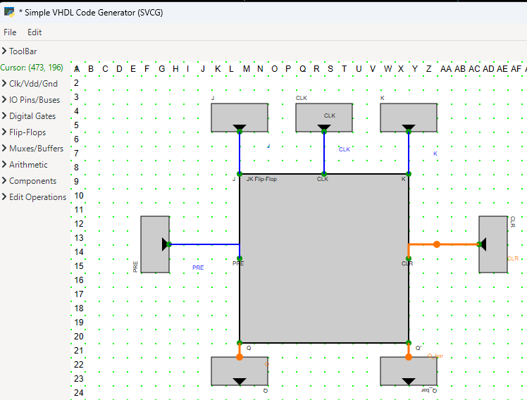

# SVCG User Manual
### Simple VHDL Code Generator — Student Edition



*JK flip-flop with all ports connected. J, K, CLK inputs enter from above; PRE (preset) from the left; CLR (reset) from the right; Q and Q̄ outputs exit below. The orange wire (CLR) is selected — drag the mid-point circle to reroute it.*

---

## 1. Window Layout

```
┌─────────────────────────────────────────────────────────────┐
│  File  Edit  [toolbar ▸]                                    │  ← Menu bar
├──────────────┬──────────────────────────────────────────────┤
│ Cursor:(x,y) │                                              │
│              │                                              │
│ ▸ Clk/Vdd/Gnd│           CANVAS  (5000 × 5000 px)          │
│ ▸ IO Pins    │         scroll with scrollbars               │
│ ▸ Digital    │         zoom with Ctrl+scroll-wheel          │
│   Gates      │                                              │
│ ▸ Flip-Flops │                                              │
│ ▸ Muxes/Buf  │                                              │
│ ▸ Arithmetic │                                              │
│ ▸ Components │                                              │
│ ▸ Edit Ops   │                                              │
│              │                                              │
├──────────────┴──────────────────────────────────────────────┤
│  Status bar — shows selected element, counts, filename      │
└─────────────────────────────────────────────────────────────┘
```

**Left panel** — click any expander label to expand/collapse that section.  
**Canvas** — all design work happens here.  
**Status bar** — the title bar shows `* SVCG` when there are unsaved changes.

---

## 2. Launching SVCG

**Windows (MSYS2 MinGW64 terminal — required):**
```bash
cd /c/Users/<you>/SVCG/src
python3 main.py
```
> Do **not** use PowerShell or CMD — GTK3 bindings are only available in the MSYS2 MinGW64 shell.

**Linux:**
```bash
cd src && python3 main.py
```

---

## 3. Your First Circuit — Half Adder

This walkthrough produces a Half Adder and generates VHDL in under 5 minutes.

### 3.1 Add IO Pins

IO pins become the `entity` ports in the generated VHDL.

1. Expand **IO Pins/Buses** in the left panel.
2. Click **Input Pin** → a pin labelled `Input` drops onto the canvas.
3. Click **Input Pin** again → a second input pin appears.
4. Click **Output Pin** twice → two output pins appear.

To rename a pin (required for meaningful VHDL port names):
- Right-click the pin body → **Rename** → type `A`, press Enter.
- Repeat for the other pins: `B`, `SUM`, `CARRY`.

### 3.2 Add Logic Gates

1. Expand **Digital Gates**.
2. Click **XOR Gate** — an XOR block drops onto the canvas.
3. Click **AND Gate** — an AND block drops.

Move blocks by left-click-dragging their body to arrange them:

```
  [A] ──┬──► [XOR] ──► [SUM]
        │
  [B] ──┼──► [XOR]
        │
        ├──► [AND] ──► [CARRY]
        │
        └──► [AND]
```

### 3.3 Draw Wires

Connection points are the small green dots on the edges of each block/pin.

1. **Left-click** a green dot to start a wire.
2. **Release** on another green dot to complete the connection.

A red/orange routed line appears. If the path is blocked, the router falls back to a Manhattan (L-shaped) path automatically.

> **Tip:** The cursor snaps to the grid (20 px). Zoom in with **Ctrl+scroll-wheel** for precision.

### 3.4 Name Internal Wires (optional but recommended)

Right-click any wire → **Rename** → type a net name (e.g. `sum_internal`).  
The name appears on the canvas and becomes a `signal` declaration in the VHDL.

### 3.5 Generate VHDL

1. **File → Generate VHDL…**
2. Enter the top-level entity name (e.g. `HALF_ADDER`).
3. Choose a save path for the `.vhd` file.
4. A VHDL preview opens automatically.

Example output:
```vhdl
entity HALF_ADDER is
    Port (
        A     : in  STD_LOGIC;
        B     : in  STD_LOGIC;
        SUM   : out STD_LOGIC;
        CARRY : out STD_LOGIC
    );
end HALF_ADDER;

architecture Structural of HALF_ADDER is
    component XOR_GATE
        Port ( A : in  STD_LOGIC := '0'; B : in  STD_LOGIC := '0';
               Y : out STD_LOGIC );
    end component;
    ...
begin
    XOR_1_0 : XOR_GATE port map ( A => A, B => B, Y => SUM );
    AND_1_1 : AND_GATE port map ( A => A, B => B, Y => CARRY );
end Structural;
```

---

## 4. All Component Types

### IO / Power

| Button | VHDL direction | Notes |
|--------|---------------|-------|
| Input Pin | `in` | Single-bit entity port |
| Output Pin | `out` | Single-bit entity port |
| Input/Output Pin | `inout` | Bidirectional |
| Input Bus | `in` | Multi-bit; each bit becomes its own port |
| Output Bus | `out` | Multi-bit |
| Input/Output Bus | `inout` | Multi-bit |
| CLK | `in` | Recognised as clock by testbench generator |
| GND / VDD x | `in` | Power rails |

### Logic Gates

AND, OR, NOT, NAND, NOR, XOR, XNOR — all 2-input (NOT is 1-input).

### Flip-Flops

| Type | Ports |
|------|-------|
| D Flip-Flop (DFF) | D, CLK, PRE, CLR → Q, Q' |
| D Flip-Flop Pipeline | D, CLK → Q |
| JK Flip-Flop | J, K, CLK, PRE, CLR → Q, Q' |
| SR Flip-Flop | S, R, CLK, PRE, CLR → Q, Q' |
| T Flip-Flop | T, CLK → Q, Q' |

### Muxes / Buffers

| Type | Select bits | Inputs |
|------|-------------|--------|
| MUX 2×1 | 1 (S0) | I0, I1 |
| MUX 4×1 | 2 (S0–S1) | I0–I3 |
| MUX 8×1 | 3 (S0–S2) | I0–I7 |
| Tristate Buf 2/4/8 | 1 (OE) | 2/4/8 data inputs |

### Arithmetic

| Type | Ports |
|------|-------|
| Half Adder (HA) | A, B → SUM, CARRY |
| Full Adder (FA) | A, B, CIN → SUM, COUT |
| FA Gray Cell / White Cell | For carry-select adder trees |

---

## 5. Mouse & Keyboard Reference

### Mouse

| Action | Effect |
|--------|--------|
| Left-click + drag on block/pin | Move element |
| Left-click green dot, release on another | Draw wire |
| Right-click block body | Context menu (rename, colors, rotate, copy, view VHDL template) |
| Right-click pin body | Pin context menu |
| Right-click wire | Wire menu (rename net, delete) |
| Shift+left-click | Add/remove from multi-select group |
| Ctrl+scroll-wheel | Zoom in/out (0.2× – 4.0×) |

### Keyboard

| Shortcut | Action |
|----------|--------|
| Ctrl+Z | Undo |
| Ctrl+R | Redo |
| Ctrl+C | Copy selected |
| Ctrl+X | Cut selected |
| Ctrl+V | Paste at cursor |
| Ctrl+D | Delete selected |
| Ctrl+P | Rotate 90° clockwise |
| Escape | Clear multi-select |

---

## 6. Working with Selections

**Single select:** left-click-drag any block or pin.

**Multi-select:** Shift+click each block, pin, or wire you want. The status bar shows the count. With a group selected you can:
- Move the whole group by dragging any selected element.
- Copy/Cut/Paste/Delete with the standard shortcuts.
- Save as a reusable component (**File → Save Selection as Component…**).

---

## 7. Save and Load

| Action | Menu item | Notes |
|--------|-----------|-------|
| Save | File → Save | Saves JSON project file |
| Save As | File → Save As | Choose a new filename |
| Load | File → Load | Replaces current canvas |
| New | File → New | Clears canvas (prompts if unsaved changes) |

Project files are plain JSON arrays. You can inspect or version-control them.

> **Unsaved changes** are indicated by `*` at the start of the window title.  
> Closing the window with unsaved changes prompts **Save / Discard / Cancel**.

---

## 8. Undo / Redo

SVCG keeps an unlimited undo history (JSON snapshots of the full canvas state).

- **Ctrl+Z** — step back one action.
- **Ctrl+R** — step forward (only available after undoing).

The **Edit Operations** expander in the left panel also has Undo/Redo buttons.

---

## 9. Styling

Right-click any block or pin body to change:
- **Border color** — the outline of the shape.
- **Fill color** — the interior background.
- **Text color** — the label colour.

These are cosmetic only and do not affect VHDL output.

**Dark mode:** File → Toggle Dark Mode — flips the GTK chrome and repaints the canvas with a dark background.

---

## 10. Simulation (GHDL + GTKWave)

**Requires:** [GHDL](https://github.com/ghdl/ghdl) on PATH.

Install on MSYS2:
```bash
pacman -S mingw-w64-x86_64-ghdl-mcode
```

**Usage:** File → Generate Testbench + Simulate…

What happens:
1. SVCG writes a structural VHDL entity (same as File → Generate VHDL…).
2. Writes a testbench with a 100 MHz clock and stimulus for every non-CLK input port.
3. Runs `ghdl -a / -e / -r --vcd` and shows the log.
4. A **Launch GTKWave** button appears if a `.vcd` waveform was produced.

> If GHDL is not on PATH, only the VHDL and testbench files are written — no simulation is run.

---

## 11. Per-Block VHDL Templates

To see the VHDL template used for any individual gate or flip-flop:

Right-click the block body → **View VHDL**

A dialog shows the component's structural VHDL template (from `src/vhdl/<type>.vhd`).

---

## 12. Component Library

Save any sub-circuit as a reusable component:

1. Shift+click the blocks and pins you want to save.
2. **File → Save Selection as Component…** — enter a name (e.g. `half_adder`).
3. The component appears under the **Components** expander on the left.
4. Click the component button to drop a fresh copy onto the canvas (all IDs are new UUIDs — no collisions).

Components are stored as JSON in `src/components/`. Click **Refresh** to pick up any files added manually.

---

## 13. SVG / PNG Export

**File → Export as SVG…** or **File → Export as PNG…**

- Produces a tight-cropped image of all canvas elements.
- Adds 40 px padding around the bounding box.
- Returns silently if the canvas is empty.

---

## 14. Yosys Netlist Import

Import a synthesis netlist produced by [Yosys](https://github.com/YosysHQ/yosys):

```bash
yosys -p "synth -flatten; write_json out.json" design.v
```

Then: **File → Import Yosys Netlist…** → select `out.json`.

Supported cells: `$_AND_`, `$_OR_`, `$_NOT_`, `$_NAND_`, `$_NOR_`, `$_XOR_`, `$_XNOR_`,
`$_MUX_`, `$_DFF_P_`, `$_DFF_N_`, `$_HA_`, `$_FA_`.  
Unsupported cell types are skipped with a warning in the status bar.

---

## 15. Common Mistakes

| Symptom | Cause | Fix |
|---------|-------|-----|
| VHDL entity has no ports | No IO pins on canvas | Add Input/Output pins before generating VHDL |
| Port name is `sig_0` in VHDL | Pin text starts with a digit | Rename the pin to start with a letter |
| Unconnected input maps to `open` in port map | Port left unwired | This is valid VHDL — the component declaration has a `'0'` default |
| Wire won't connect | Releasing on the canvas instead of a green dot | Aim for the small green dot exactly; zoom in |
| Blocks overlap and wires look tangled | Elements placed too close | Use Ctrl+Z and rearrange; zoom in with Ctrl+scroll |
| GHDL reports errors | Generated VHDL references a component whose `.vhd` is missing | Ensure all component template files are present in `src/vhdl/` |

---

## 16. Workflow Cheat-Sheet

```
1. Add IO pins (Input/Output Pin) → rename them
2. Add logic blocks from the left panel
3. Arrange with left-click-drag; zoom with Ctrl+scroll
4. Wire connection dots (green) left-click → release
5. Rename wires (right-click → Rename) for readable signal names
6. File → Generate VHDL… → enter entity name → save .vhd
7. (Optional) File → Generate Testbench + Simulate… → view waveform
8. File → Save → keep your .json project file
```
